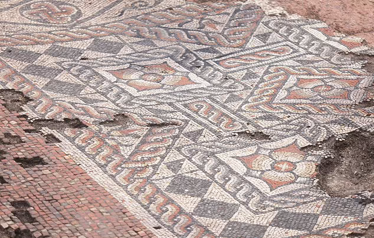
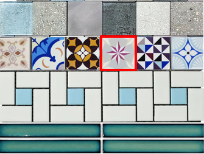
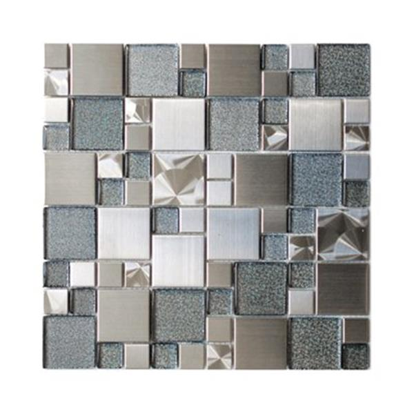
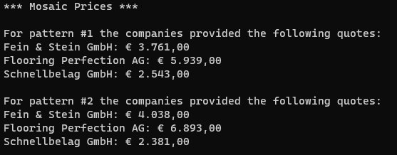

:sectnums:
:nofooter:
:toc: left
:icons: font
:data-uri:
:source-highlighter: highlightjs
:stem: latexmath

= OOB.04 -- Mosaic

In this exercise you will represent mosaic floor patterns as objects and have various companies calculate an offer for constructing them.

[plantuml]
----
@startuml

hide empty methods

enum WorkSpeed {
    Slow
    Regular
    Fast
}

enum PatternStyle {
    Simple
    Complex
}

enum TileStyle {
    Raw
    Polished
    PlainColor
    FancyColor
    SimplePattern
    Ornate
}

class Worker {
    +string Name [readonly]
    +WorkSpeed WorkSpeed [readonly]
}

class Company {
    -int DefaultPiecesPerHour [const]
    -decimal _hourlyWage [readonly]
    -decimal _m2Price [readonly]
    -int _profitMargin [readonly]
    -Worker[] _workers  [readonly]
    +string Name [readonly]

    +Company(string, decimal, decimal, int, Worker[])
    +decimal GetCostEstimate(TilePattern)
    -double CalcPiecesPerHour(PatternStyle)
}

class Tile {
    -TileStyle _style [readonly]
    -int _width [readonly]
    -int _height [readonly]
    +int Area [readonly]

    +Tile(TileStyle, int, int)
    +decimal CalcProductionCost()
}

class TilePattern {
    -Tile[] _tiles [readonly]
    +int Pieces [readonly]
    +double Area [readonly]
    +PatternStyle Style [readonly]

    +TilePattern(PatternStyle, Tile[])
    +decimal CalcProductionCost()
}

Company "1" -- "n" Worker: employs
Worker -r- WorkSpeed
TilePattern "1" -- "n" Tile: consists of
Tile -r- TileStyle
TilePattern -r- PatternStyle

@enduml
----

WARNING: Some implementation as well as unit tests have been provided to you. Consider commenting some code to allow the application to compile until you have implemented all missing pieces. Also make sure to use the correct names and method signatures or the unit tests (and `Program`) won't work.

== `Tile` class

A single mosaic tile in a pattern.
It is defined by a specific style and a size (in mm).
Based on this information it can calculate its own production cost.

Tiles can come in various styles with increasing production difficulty.
For example a tile could have only a polished finish or a multicolored ornate pattern.

=== Production cost calculation

The following rules apply when calculating the production cost for a single tile.

* Each tile has a base price of 0.016€ per stem:[cm^2]
* Size modification factors -- very small or very large tiles are more expensive than a standard size
** stem:[a < 100 mm^2] => x1.5
** stem:[a < 400 mm^2] => x1.2
** stem:[400 \le a \le 2500] => x1
** stem:[a > 2500 mm^2] => x1.6
** stem:[a > 8100 mm^2] => x1.8
** Only _one_ of those modifiers is applied
*** So for size stem:[50mm^2] it would be x1.5 and _not_ x2.7
* Fancier tiles are more expensive to produce, so the production cost is increased by the following factors:
** `Raw` => x0.8
** `Polished` & `PlainColor` => x1
** `FancyColor` => x1.1
** `SimplePattern` => x1.25
** `Ornate` => x2.3

Final calculation: stem:[areaInCm^2 * pricePerCm^2 * sizeFactor * styleFactor]

== `TilePattern` class

This class represents a combination of individual tiles in various shapes and colors to form a pattern.
Cost estimates are always created by companies for a whole pattern as a single unit.

=== Implementation Hints

* The number of pieces equals the number of tiles contained in the pattern
* The area is the sum of the area of all tiles in stem:[m^2]
** We are ignoring the space the joints between the tiles would take
* The production cost is simply the sum of the production cost of all tiles
** Pattern style does not change the production cost
*** It will make a difference when calculating the work cost later

TIP: It is possible to define numbers in scientific notation, e.g. `1E-6D`

== `Company` class

Each instance of this class represents one company which specializes in laying mosaic floors.

* A company employees one or more `Worker`
* It demands a certain base price per stem:[m^2] laid
* For _each_ of the workers a certain hourly wage has to be paid
* All companies pay the same production cost for the tiles, but they put different amounts of a profit margin on top of that
** e.g. 100€ production cost, 5% margin => 105€ total price for the material
** We are ignoring costs for joints material etc.

NOTE: `Worker` is a simple, already provided `record` without any operations -- also the `Name` property is just flavor. You don't have to implement any functionality for it.

=== Pieces per hour

Each worker can work either slowly, normal or fast:

* With regular speed 25 tiles can be laid down per hour.
* A fast worker is 20% faster
* A slow worker is 20% slower

It takes _twice_ as long to work on a `Complex` pattern than on an easy one -- the default speed assumes a `Simple` pattern.

On each job all workers are working together and at the same time.
So the total amount of pieces laid per hour is based on the stats of all workers of the company, adjusted by their individual speed and modified if the pattern is complex.

=== Cost calculation

The total quote a company calculates for laying a mosaic is based on the following parts:

. The base price which has to be paid for the total amount of stem:[m^2] the mosaic covers
. The work time
** Time needed to construct the pattern, multiplied by hourly wage
. The production cost of the tiles
** Plus profit margin on top

The final amount is rounded _up_ to the next whole number.

== `Program` & Sample Run

The `Program` class is already complete.
It will create some sample tile patterns and companies from which it requests cost estimates for those.

